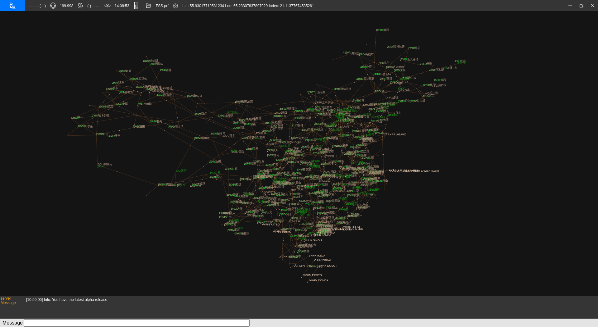
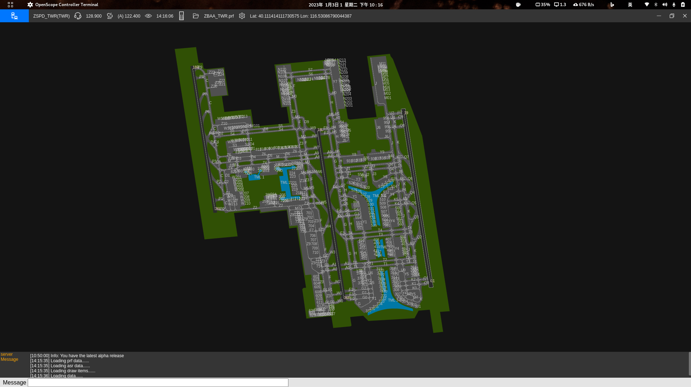
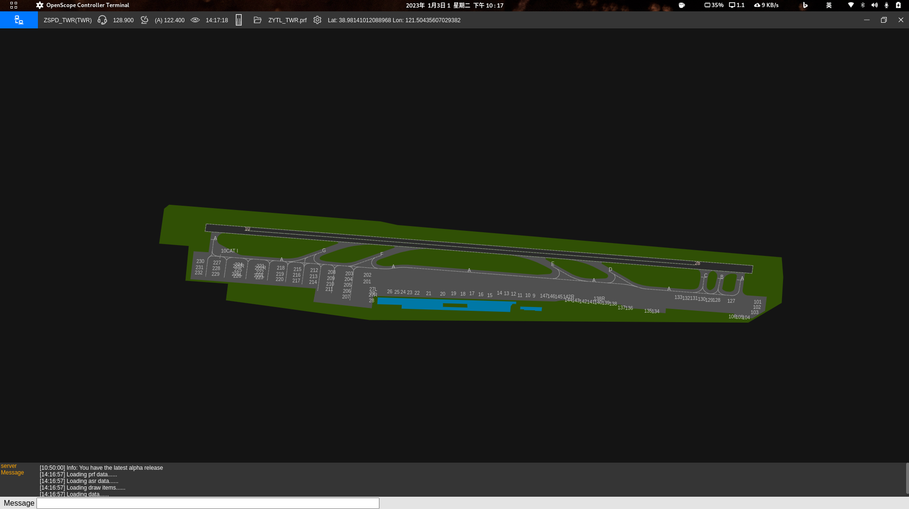

<p align=center>
  <a href="https://openvmsys.cn/openscope">
    
  </a>
</p>

<p align=center>
A cross platform ATC terminal
</p>

<p align=center>
  
  
  
  
  
</p>

> Openscope is a cross-platform controller terminal for [VATSIM](https://vatsim.net/) FSD Server (not recognized yet) & [TeleFlight Server](https://openvmsys.cn/tfs/#/), supporting Windows / Linux / macOS. I wrote this software mainly for those linux (and of course, macOS!) users who want to be a controller but restricted by windows based Euroscope controller software. I made it open source because I want to grow a community of controller, in which there are men and women full of passion for challenge, and have the courage to break free.

<p align=center>

<br>
<button onclick="window.location=https://github.com/Ericple/openscope-project/releases/latest" style="position: relative;width:120px;height:40px;border-radius:6px;background-color:rgb(0, 119, 255);color:white;border:none;font-size:16px;margin:auto;cursor:pointer;">Download</button>
</p>

# Screenshots






# Contributing

All contributions are welcomed. Before forking this repository, please consider the followings:

- Am I familier with [TypeScript](https://www.typescriptlang.org/) and [Electron](https://electronjs.org/)?
- Am I familier with [Euroscope](https://www.euroscope.hu/wp/) and its configuration files?
- Do I know the basic knowledge of ATC?

## Debug

For the first start, run:

```
npm i && npm run start
```

Afterwards, upon each debugging, if you did not edit any file in /pages or /config, use `npm run quicks` to skip the asset copying process. Otherwise, you still need
to use `npm run start` to start debugging.

# Thanks to

- ***iconv-jschardet*** package for supporting gbk format.


- ***Wenlue Zhang*** for pointing out the sucked code for UTC Time Display interval function, and his code review helps a lot.

- ***Ian Cowan*** for his [AviationAPI](https://aviationapi.com/about).

# FAQ

- <del>The freetexts are covered by the airport polygon, what should I do?</del> ***(This bug should have been fixed)***
  - Please refers to the .asr file your sector loads, open it with the text editor you like, find those lines prefixed with "Regions:", cut all these lines and paste it under "SECTORTITLE:", like the example below：
  ```
    DisplayTypeName:Standard ES radar screen
    DisplayTypeNeedRadarContent:1
    DisplayTypeGeoReferenced:1
    SECTORFILE:
    SECTORTITLE:
    ;The Regions should be right under the "SECTORTITLE:" line
    Regions:ZSSS:polygon
    Regions:ZSPD:polygon
    ......
  ```

- How to request metar in openscope?
  - Just the same as in Euroscope.